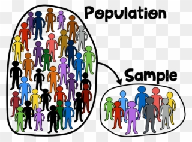

```{r setup, include = FALSE}
library(webexercises)
library(tinytex)
library(dplyr)
library(knitr)
library(ggplot2)
library(infer)
```

```{r eval=FALSE, echo=FALSE}
install.packages("bookdown")
```

```{r include=FALSE, echo=FALSE}
knitr::write_bib(c(
  .packages(), 'bookdown', 'knitr', 'rmarkdown'
), 'packages.bib')
```

# Welcome to Lab 4 {-}

### Intended Learning Outcomes {-}

```{r graphic1, echo = FALSE, out.width = "30%", fig.cap = "", out.extra='style="float:left; padding:10px"'}

```

<br>

In this lab we investigate the ways in which sample statistics calculated from a random sample of data can serve as point estimates for population parameters.  We're 
interested in formulating a *sampling distribution* of our point estimate in order 
to learn about the properties of the estimate, such as its shape, centre and spread. From that distribution we can calculate *confidence intervals* as interval estimates for the unknown population parameters.

The material within this lab has been based on OpenLearn Chapter 5 
<a href="https://www.openintro.org/redirect.php?go=os4_tablet&referrer=/stat/os4.php#page=168">OpenIntro Page 168</a>. Feel free to refer back to the materials to help you within this lab. 

<br>

### Credit where credit is due {-}

The labs in S1Y/Z are a derivative of the labs on the <a href="https://www.openintro.org/book/os/">OpenIntro Statistics website</a> by the <a href="https://www.openintro.org/team/"> OpenIntro team</a> used under a <a href="https://creativecommons.org/licenses/by-sa/4.0/">Creative Commons Attribution-ShareAlike 4.0 International License</a>.  Some of the artwork used is by <a href="https://github.com/allisonhorst/stats-illustrations">allison_horst</a>

<br>
